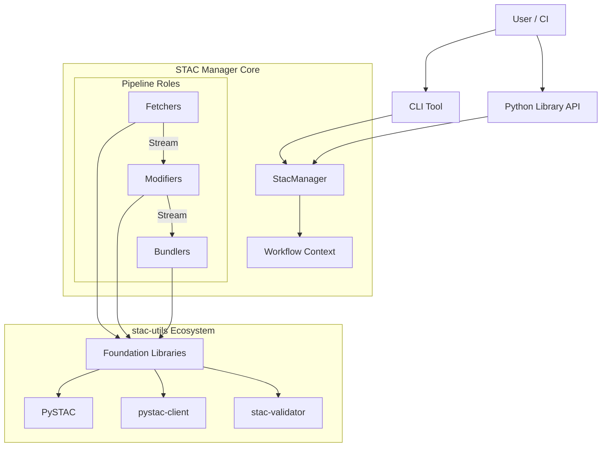

# System Overview
## STAC Manager v1.0

**Related Documents**:
- [PRD](../../development/STAC-Manager-PRD-v1.0.3.md)
- [Pipeline Management](./01-pipeline-management.md)

---

## 0. System Requirements
- **Python**: 3.12+ (Required for structural pattern matching and type hinting features)
- **OS**: Linux, macOS, Windows
- **Core Dependencies**:
    - `pystac>=1.10.0`
    - `pystac-client>=0.7.0`
    - `stac-validator>=3.3.0`
    - `stac-geoparquet>=0.4.0`

## 1. Architectural Philosophy

The STAC Manager is a **composable pipeline manager** built on the **Pipes and Filters** design pattern. The architecture follows these core principles:

- **Modularity (Filters)**: Self-contained components with specialized roles:
    - **Fetchers (Sources)**: Retrieve and originate item streams (Discovery, Ingest).
    - **Modifiers (Processors)**: Transform or enrich items in-stream (Transform, Scaffold, etc.).
    - **Bundlers (Sinks)**: Finalize and aggregate processed items (Output).
- **Role-Based Protocols**: Type-safe interfaces tailored to the component's behavior (`fetch()`, `modify()`, `bundle()`).
- **Configuration-Driven**: Workflows defined in YAML, executed by a central manager.
- **Async Pipeline**: A high-efficiency `asyncio` loop manages the "Pipe", while "Filters" can be sync or async based on their bottleneck (I/O vs. CPU).
- **Graceful Degradation**: "Collect and continue" strategy mediated by the shared `WorkflowContext`.

## 2. System Context

The **StacManager** bridges User Interfaces with Foundation Libraries by wiring specialized components into a cohesive pipeline.

    
## 3. Data Flow Patterns (Role-Based)

### The Pipes and Filters Model
Instead of a generic execution model, STAC Manager uses specialized roles to resolve the friction between Async I/O and Sync CPU processing:

1.  **Fetcher (Async Source)**: Handles the complexity of API pagination and network retries, yielding a consistent `AsyncIterator`.
2.  **Modifier (Sync Filter)**: Performs item-level logic (e.g., JMESPath mapping). By keeping this sync, we simplify developer implementation and leverage CPU efficiently.
3.  **Bundler (Sync/Async Sink)**: Aggregates items. For the **Parquet Cache** strategy, the Bundler collects item batches and uses parallel background threads for mass-serialization.

---

## 4. Architectural Layers

The system is organized into four distinct layers:

### Layer 1: User Interface
- **Responsibilities**: Parse arguments, load/validate config, expose public API.
- **Components**: `cli/`, `config/`, public package exports.

### Layer 2: Pipeline Management (StacManager)
- **Responsibilities**: Build workflow DAGs, schedule steps, manage state (`WorkflowContext`), wire Fetchers to Bundlers.
- **Components**: `StacManager`, `PipelineBuilder`, `FailureCollector`.
- **Key Decision**: Rename `WorkflowOrchestrator` to `StacManager` to better reflect its role as the pipeline lifecycle manager.

### Layer 3: Pipeline Components (Roles)
- **Responsibilities**: Implement domain logic within specialized protocols.
- **Components**: Fetchers, Modifiers, and Bundlers.
- **Key Decision**: Replace generic `ModuleProtocol` with role-specific interfaces to solve async/sync friction.

### Layer 4: Foundation (External)
- **Responsibilities**: Standard STAC models, validation, and API clients.
- **Components**: `PySTAC`, `pystac-client`, `stac-validator`, `stac-geoparquet`.

## 5. Async & Concurrency Model

- **The Pipe**: The central StacManager loop is `async`.
- **Async Sources**: Fetchers are natively `async` to handle high-concurrency API requests.
- **Sync Filters**: Modifiers are `sync` to simplify CPU-bound logic (transformation, validation). The manager handles the async-wrap.
- **Threaded Sinks**: Bundlers use `ThreadPoolExecutor` (via Utilities) for blocking File I/O when writing Parquet or large JSON sets.

---

## 6. Dependency Integration

| Library | Role | Usage in Toolkit |
|---------|------|------------------|
| **PySTAC** | Data Model | Foundation for all Fetchers/Modifiers/Bundlers |
| **pystac-client** | API Client | Primary engine for API-based Fetchers |
| **stac-validator** | Validation | Core logic for the Validate Modifier |
| **stac-geoparquet** | Format Conversion | Used by Bundlers for Parquet output |
| **aiohttp** | Async HTTP | Engine for high-concurrency Fetchers |

## 6. Summary

The `StacManager` v1.0 architecture implements a high-performance **Pipes and Filters** model optimized for streaming massive STAC catalogs. By strictly separating I/O (Fetchers), Logic (Modifiers), and Persistence (Bundlers), the system remains modular, testable, and robust against memory-related failures.
