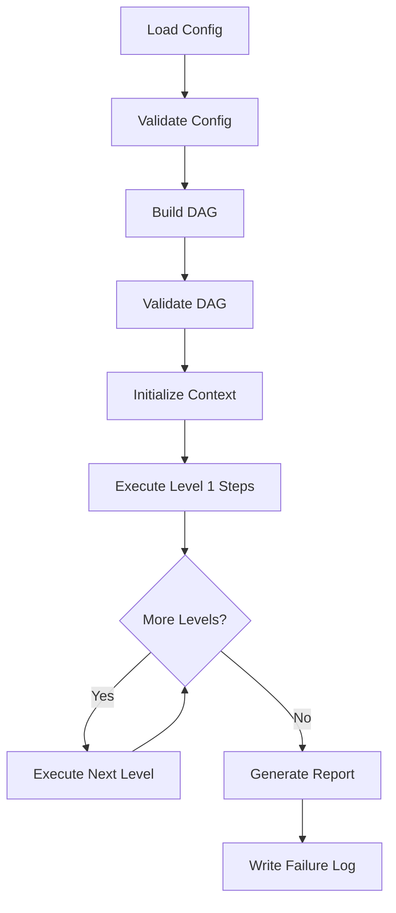
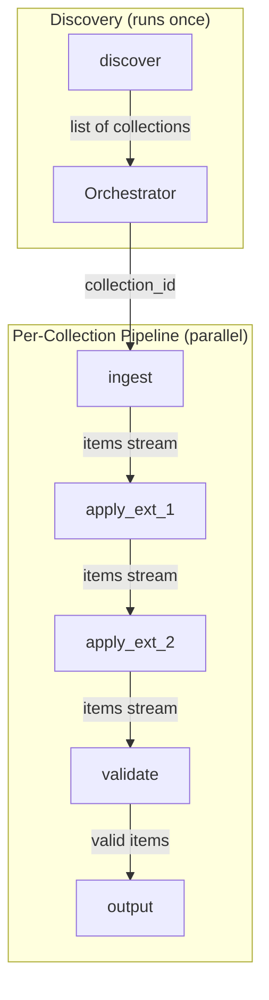

# Pipeline Management (StacManager)
## STAC Manager v1.0

**Related Documents**:
- [System Overview](./00-system-overview.md)
- [Protocols](./06-protocols.md)
- [Utilities](./07-utilities.md)
- [Configuration](./03-configuration.md)
- [Data Contracts](./05-data-contracts.md)

---

## 1. Concepts

The **StacManager** is the engine that executes a pipeline of STAC operations.

- **Workflow**: A named configuration defining a Directed Acyclic Graph (DAG) of **Steps**.
- **Step**: A single unit of work (e.g., "fetch items", "transform data") executed by a **Module**.
- **Dependency**: Steps can depend on previous steps. The orchestrator resolves topological order and parallelism.
- **Context**: A shared `WorkflowContext` object passed to every step, containing configuration, logger, failure collector, and a data store.

## 2. Orchestration Architecture

### The StacManager
The `StacManager` class:
1. Loads and validates the YAML configuration.
2. Builds a pipeline DAG from step dependencies.
3. Validates the DAG (no cycles, all dependencies exist).
4. Instantiates components (Fetchers, Modifiers, Bundlers) for each step.
5. Executes the pipeline levels, wiring streams between roles.
6. Aggregates results and generates a summary report.

### High-Level Flow



---

## 3. WorkflowContext Specification

The `WorkflowContext` is the shared state object passed to every module's `execute()` method.

### 3.1 Structure

```python
from dataclasses import dataclass
from typing import Any, TypedDict
import logging
from stac_manager.config import WorkflowDefinition

@dataclass
class WorkflowContext:
    """Shared state for pipeline execution."""
    workflow_id: str                      # Unique execution identifier
    config: 'WorkflowDefinition'          # Full workflow definition
    logger: logging.Logger                # Structured logger instance
    failure_collector: FailureCollector   # Error aggregator
    checkpoints: CheckpointManager        # State persistence manager
    data: dict[str, Any]                  # Inter-step ephemeral data store

def _init_context(config: WorkflowDefinition) -> WorkflowContext:
    """Create workflow context from configuration."""
    return WorkflowContext(
        workflow_id=config.name,
        config=config,
        logger=setup_logger(config.settings.logging),
        failure_collector=FailureCollector(),
        checkpoints=CheckpointManager(directory=..., workflow_id=config.name),
        data={}
    )
```

---

## 4. FailureCollector Specification

The `FailureCollector` aggregates non-critical errors during workflow execution.

### 4.1 Public Interface

```python
from dataclasses import dataclass
from datetime import datetime
from typing import Any

@dataclass
class FailureRecord:
    """Single failure record."""
    step_id: str          # Step where failure occurred
    item_id: str          # Item/record identifier (or "unknown")
    error_type: str       # Exception class name or error category
    message: str          # Error message
    timestamp: str        # ISO 8601 timestamp
    context: 'FailureContext | None'  # Optional additional context

class FailureContext(TypedDict, total=False):
    """Context for failure debugging."""
    source_file: str
    line_number: int
    field_name: str
    url: str
    http_status: int
    retry_attempt: int

class FailureCollector:
    """Collect and manage non-critical failures."""
    
    def add(
        self, 
        item_id: str, 
        error: str | Exception,
        step_id: str = 'unknown',
        error_context: 'FailureContext | None' = None
    ) -> None:
        """
        Add a failure record.
        
        Args:
            item_id: Identifier of failed item
            error: Error message or exception
            step_id: Step ID where failure occurred
            error_context: Additional context (line number, source file, etc.)
        """
        ...
    
    def get_all(self) -> list[FailureRecord]:
        """Get all collected failures."""
        ...
    
    def write_report(self, output_path: str) -> None:
        """
        Write failures to JSON file.
        
        Output format defined in data-contracts.md
        """
        ...
    
    def count(self) -> int:
        """Get total failure count."""
        ...
    
    def count_by_step(self) -> dict[str, int]:
        """Get failure counts grouped by step_id."""
        ...
```

### 4.2 Usage Pattern

```python
# In a module's execute() method
async def execute(self, context: WorkflowContext):
    for item in source_items:
        try:
            result = process_item(item)
            results.append(result)
        except ValidationError as e:
            # Non-critical: log and continue
            context.failure_collector.add(
                item_id=item.get('id', 'unknown'),
                error=str(e),
                step_id='transform',
                error_context={'source_file': self.source_file}
            )
            continue
    
    return results
```

---

## 5. Error Class Hierarchy

### 5.1 Exception Classes

```python
class StacManagerError(Exception):
    """Base exception for all STAC Manager errors."""
    pass

class ConfigurationError(StacManagerError):
    """
    Configuration validation failed.
    
    Usage: Raise at startup when config is invalid
    Effect: Workflow aborts before execution starts
    """
    pass

class ModuleException(StacManagerError):
    """
    Critical module error.
    
    Usage: Raise when module cannot continue (missing dependency, invalid state)
    Effect: Workflow step fails, orchestrator aborts (or continues to next branch)
    """
    pass

class WorkflowConfigError(StacManagerError):
    """
    Invalid workflow definition.
    
    Usage: Raise when workflow has structural errors (cycles, missing steps)
    Effect: Workflow aborts before execution starts
    """
    pass

class WorkflowExecutionError(StacManagerError):
    """
    Workflow execution failed.
    
    Usage: Raised by orchestrator when critical step fails
    Effect: Workflow terminates, error logged
    """
    pass

class DataProcessingError(StacManagerError):
    """
    Non-critical data error.
    
    Usage: For item-level failures that should be collected, not raised
    Effect: Caught by module, logged to FailureCollector
    
    Note: This is often caught immediately, not propagated
    """
    pass

class ExtensionError(StacManagerError):
    """
    Extension apply/validate error.
    
    Usage: When extension cannot be applied to item
    Effect: Depends on context (may be collected or raised)
    """
    pass
```

### 5.2 Error Handling Strategy

| Error Type | When to Raise | Handling Strategy |
|------------|---------------|-------------------|
| `ConfigurationError` | Invalid YAML, missing required fields | Fail fast at startup |
| `WorkflowConfigError` | DAG cycles, unknown step dependencies | Fail fast at startup |
| `ModuleException` | Module cannot execute (missing file, invalid config) | Abort workflow |
| `DataProcessingError` | Single item failed validation/transform | Collect and continue |
| `ExtensionError` | Extension cannot be applied | Collect and continue (or abort if strict) |

---

## 6. DAG Building Algorithm

### 6.1 Purpose
Determine execution order from step dependencies, enabling parallel execution of independent steps.

### 6.2 Algorithm: Topological Sort

**Approach**: Kahn's Algorithm (BFS-based topological sort with level detection)

**Steps**:
1. Calculate in-degree (number of dependencies) for each step
2. Find all steps with zero dependencies → Execution Level 1
3. Remove Level 1 steps from graph, decrement in-degrees
4. Find new zero-dependency steps → Execution Level 2
5. Repeat until all steps assigned or cycle detected

**Output**: List of execution levels, where each level contains steps that can run in parallel

```python
def build_dag(steps):
    """
    Pseudocode for Dependency Resolution (Kahn's Algorithm).
    """
    # 1. Initialize graph tracking
    in_degree = {step.id: 0 for step in steps}
    graph = {step.id: [] for step in steps}
    
    # 2. Build adjacency list and calculate in-degrees
    for step in steps:
        for dependency in step.depends_on:
            # Tier 2: Validation Logic
            if dependency not in [s.id for s in steps]:
                raise WorkflowConfigError(f"Step '{step.id}' depends on unknown step '{dependency}'")
            
            graph[dependency].append(step.id)
            in_degree[step.id] += 1
            
    # 3. Find initial nodes (Level 0)
    queue = [s for s in steps if in_degree[s] == 0]
    execution_levels = []
    
    # 4. Process graph level-by-level
    while queue is not empty:
        current_level = queue  # All nodes in queue can run in parallel
        execution_levels.append(current_level)
        
        next_queue = []
        for step in current_level:
            # "Remove" step and process neighbors
            for neighbor in graph[step]:
                in_degree[neighbor] -= 1
                if in_degree[neighbor] == 0:
                    next_queue.append(neighbor)
        
        queue = next_queue

    # 5. Cycle Detection
    if count(execution_levels) < total_steps:
        raise Error("Cycle detected")
        
    return execution_levels
```

### 6.3 Example

**Workflow Configuration**:
```yaml
steps:
  - id: discover         # No dependencies
  - id: ingest           # depends_on: [discover]
  - id: apply_dgeo       # depends_on: [ingest]
  - id: apply_eo         # depends_on: [ingest]
  - id: validate         # depends_on: [apply_dgeo, apply_eo]
  - id: output           # depends_on: [validate]
```

**DAG Output**:
```python
[
    ['discover'],              # Level 0: No dependencies
    ['ingest'],                # Level 1: Depends on discover
    ['apply_dgeo', 'apply_eo'],# Level 2: Both depend on ingest (parallel!)
    ['validate'],              # Level 3: Depends on both extensions
    ['output']                 # Level 4: Depends on validate
]
```

---

## 7. Module Loading Mechanism

### 7.1 Module Registry

The orchestrator maintains a mapping of module class names to Python module paths:

```python
MODULE_REGISTRY = {
    'DiscoveryModule': 'stac_manager.modules.discovery.DiscoveryModule',
    'IngestModule': 'stac_manager.modules.ingest.IngestModule',
    'TransformModule': 'stac_manager.modules.transform.TransformModule',
    'ScaffoldModule': 'stac_manager.modules.scaffold.ScaffoldModule',
    'ExtensionModule': 'stac_manager.modules.extension.ExtensionModule',
    'ValidateModule': 'stac_manager.modules.validate.ValidateModule',
    'UpdateModule': 'stac_manager.modules.update.UpdateModule',
    'OutputModule': 'stac_manager.modules.output.OutputModule',
}
```

### 7.2 Dynamic Import Strategy

```python
def _import_module(module_class_name: str):
    """
    Dynamically import and return module class.
    
    Args:
        module_class_name: Class name from workflow YAML (e.g., 'DiscoveryModule')
    
    Returns:
        Module class (not instance)
    
    Raises:
        WorkflowConfigError: If module not found in registry
        ImportError: If module cannot be imported
    """
    module_path = MODULE_REGISTRY.get(module_class_name)
    if not module_path:
        raise WorkflowConfigError(f"Unknown module: {module_class_name}")
    
    # Split into module path and class name
    module_name, class_name = module_path.rsplit('.', 1)
    
    # Import module and get class
    from importlib import import_module
    module = import_module(module_name)
    return getattr(module, class_name)
```

### 7.3 Step Execution (Role-Based)

The StacManager executes steps by identifying their role and wiring the data flow accordingly.

```python
async def _execute_step(step_id: str, context: WorkflowContext):
    """Execute a single pipeline step."""
    step_config = steps[step_id]
    component_class = _import_component(step_config.module)
    instance = component_class(step_config.config)
    
    # 1. Determine Input Stream
    input_data = context.data.get(step_config.depends_on[0]) if step_config.depends_on else None

    # 2. Execute based on Role
    if hasattr(instance, 'fetch'):
        # Role: Fetcher (Source)
        # 1.1 Check if fetcher accepts input (Handoff pattern)
        if _accepts_input(instance.fetch) and input_data is not None:
             result = instance.fetch(context, items=input_data)
        else:
             result = instance.fetch(context)
        
    elif hasattr(instance, 'modify'):
        # Role: Modifier (Processor)
        async def modifier_pipe(stream: AsyncIterator[dict]):
            async for item in stream:
                # 2.1 Automatic Resume Check (Checkpointing)
                if context.checkpoints.contains(item['id']):
                    continue
                
                # 2.2 Execute Module logic
                modified = instance.modify(item, context)
                if modified is not None:
                    yield modified
        
        result = modifier_pipe(input_data)
        
    elif hasattr(instance, 'bundle'):
        # Role: Bundler (Sink)
        async for item in input_data:
            instance.bundle(item, context)
        
        result = instance.finalize(context)
    
    # 3. Store Result (Stream or Manifest)
    context.data[step_id] = result
```

#### 7.4 Handling Branching Streams
If a Fetcher or Modifier output is needed by multiple downstream steps, the StacManager uses `stream_tee` to prevent iterator exhaustion.

```python
async def stream_tee(
    iterator: AsyncIterator[T], 
    n: int = 2
) -> tuple[AsyncIterator[T], ...]:
    """Split an async iterator into n independent buffers."""
    ...
```

---

## 8. Data Flow Visualization

### 8.1 Collection-Centric Data Flow

Each collection is processed through an independent linear pipeline:



### 8.2 Collection-Centric Parallel Execution

The Discovery Fetcher yields a list of Collections. The **StacManager** spawns **independent pipelines per Collection**, enabling parallelism at the collection level while maintaining a linear item flow within each pipeline.

```python
# Pseudocode: StacManager Collection-Centric Flow
collections = await discovery_fetcher.fetch(context)

# Parallel collection processing
async def process_collection(collection_id: str):
    """Run a linear pipeline for one collection."""
    # 1. Fetch Items
    stream = await ingest_fetcher.fetch(context, collection_id=collection_id)
    
    # 2. Modify Items (Sequential Modifiers)
    stream = apply_modifier(transform_mod, stream)
    stream = apply_modifier(validate_mod, stream)
    
    # 3. Bundle Results
    await output_bundler.bundle_stream(stream, context)
    return await output_bundler.finalize(context)

# Launch parallel pipelines
results = await asyncio.gather(*[process_collection(c.id) for c in collections])
```

> [!NOTE]
> **Workflow Flexibility**: The example above shows a typical `Discover -> Ingest -> Extensions -> Validate -> Output` flow. 
> Other valid patterns include:
> - `Ingest -> Output` (dump raw STAC to Parquet)
> - `Transform -> Scaffold -> Validate -> Output` (ETL from CSV)
> - `Ingest -> Update -> Output` (patch existing metadata)
>
> The `depends_on` field in workflow YAML defines the execution order.

---

## 9. Workflow Execution

 ### 9.1 Execution Pattern

```python
async def execute() -> WorkflowResult:
    """Execute workflow and return results."""
    
    # 1. Build DAG
    execution_levels = build_dag(self.steps)
    
    # 2. Execute level-by-level
    for level_idx, level in enumerate(execution_levels):
        logger.info(f"Executing level {level_idx}: {level}")
        
        # Execute all steps in level concurrently
        tasks = [_execute_step(step_id, context) for step_id in level]
        await asyncio.gather(*tasks)
    
    # 3. Generate results
    # Success = No critical crashes (Partial item failures are allowed)
    return WorkflowResult(
        success=True, 
        status='completed_with_failures' if context.failure_collector.count() > 0 else 'completed',
        summary=generate_processing_summary(result, context.failure_collector),
        failures_path=config.get('output_failures', 'failures.json')
    )
```

### 9.2 Parallel Execution

Steps within the same execution level run **concurrently** using `asyncio.gather()`:
- Maximizes throughput
- Respects dependencies (steps only run after all dependencies complete)
- Handles failures gracefully (one step failure doesn't crash others in same level)

---

## 10. Summary

This document defines:

1. **WorkflowContext**: Shared state structure with config, logger, failure collector, and data store
2. **FailureCollector**: Interface for non-critical error aggregation
3. **Error Classes**: Complete exception hierarchy for different failure modes
4. **DAG Algorithm**: Topological sort for dependency resolution and parallel execution
5. **Module Loading**: Dynamic import mechanism with registry
6. **Data Flow**: How results pass between steps via context.data

These specifications provide the complete orchestration architecture needed for implementation.
