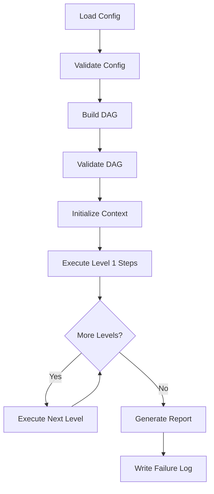
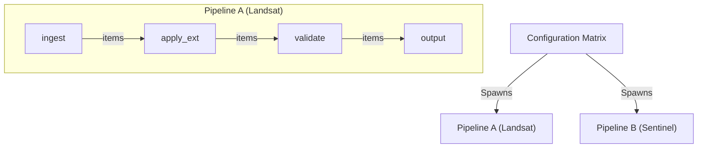

# Pipeline Management (StacManager)
## STAC Manager v1.0

**Related Documents**:
- [System Overview](./00-system-overview.md)
- [Protocols](./06-protocols.md)
- [Utilities](./07-utilities.md)
- [Configuration](./03-configuration.md)
- [Data Contracts](./05-data-contracts.md)

---

## 1. Concepts

The **StacManager** is the engine that executes a pipeline of STAC operations.

- **Workflow**: A named configuration defining a Directed Acyclic Graph (DAG) of **Steps**.
- **Step**: A single unit of work (e.g., "fetch items", "transform data") executed by a **Module**.
- **Dependency**: Steps can depend on previous steps. The orchestrator resolves topological order and parallelism.
- **Context**: A shared `WorkflowContext` object passed to every step, containing configuration, logger, failure collector, and a data store.

## 2. Orchestration Architecture

### The StacManager
The `StacManager` class:
1. Loads and validates the YAML configuration.
   - 1a. Resolves variable substitutions (Environment & Matrix context).
2. Builds a pipeline DAG from step dependencies.
3. Validates the DAG (no cycles, all dependencies exist).
4. Instantiates components (Fetchers, Modifiers, Bundlers) for each step.
5. Executes the pipeline levels, wiring streams between roles.
6. Aggregates results and generates a summary report.

### 2.1 Matrix Execution Strategy (Parallelism)
The **Matrix Strategy** allows the StacManager to spawn parallel pipelines based on a global configuration list (e.g., a list of collections or regions).

- **Concept**: The configuration defines a matrix (e.g., `input_matrix: collections`).
- **Behavior**: The StacManager iterates over this matrix *before* starting execution. For each entry, it creates a fully isolated pipeline instance (sharing the same DAG structure) injected with the specific matrix values (e.g., `collection_id`).
- **Benefit**: Fault isolation. If one collection fails, others continue processing.

### High-Level Flow



---

## 3. WorkflowContext Specification
 
 See [Data Contracts](./05-data-contracts.md#22-workflowcontext).
 
 ---
 
 ## 4. FailureCollector Specification
 
 See [Data Contracts](./05-data-contracts.md#23-failurecollector).

---

## 5. Error Class Hierarchy
 
 See [Data Contracts](./05-data-contracts.md#21-exception-hierarchy).

---

## 6. DAG Building Algorithm

### 6.1 Purpose
Determine a linear valid execution order from step dependencies. 
This allows users to define flexible, readable dependency graphs (DAGs) in configuration—including branching parallel logic—while the engine executes them as a stable linear sequence to ensure predictable stream processing.

### 6.2 Algorithm: Topological Sort + Linearization

**Approach**: Kahn's Algorithm (BFS-based topological sort) -> Flattened List

**Steps**:
1. Calculate in-degree (number of dependencies) for each step.
2. Identify independent steps (Level 0).
3. Resolve dependencies layer by layer to build "Execution Levels".
4. **Flatten** levels into a single ordered list: `[Step A, Step B, Step C]`.

**Output**: A single list of steps in execution order.

```python
def build_execution_order(steps):
    """
    Pseudocode for Dependency Resolution & Linearization.
    """
    # 1. Build Dependency Graph
    graph = build_graph(steps)
    
    # 2. Topological Sort (Kahn's Algorithm)
    execution_levels = topological_sort(graph)
    
    # 3. Cycle Detection
    if len(flatten(execution_levels)) < len(steps):
        raise Error("Cycle detected")
        
    # 4. Linearization (Flattening)
    # Convert [[A], [B, C], [D]] -> [A, B, C, D]
    # Note: B and C order is deterministic within the algorithm but interchangeable in the graph
    linear_order = [step for level in execution_levels for step in level]
        
    return linear_order
```

### 6.3 Example

**Workflow Configuration** (Branching Style):
```yaml
steps:
  - id: ingest           # No dependencies
  - id: apply_dgeo       # depends_on: [ingest]
  - id: apply_eo         # depends_on: [ingest]
  - id: validate         # depends_on: [apply_dgeo, apply_eo]
  - id: output           # depends_on: [validate]
```

**DAG Processing**:
1.  **Levels**: `[[ingest], [apply_dgeo, apply_eo], [validate], [output]]`
2.  **Flatten**: `['ingest', 'apply_dgeo', 'apply_eo', 'validate', 'output']`

**Final Execution Order**:
```python
['ingest', 'apply_dgeo', 'apply_eo', 'validate', 'output']
```

> [!NOTE]
> **Config vs Execution**: The configuration example above suggests `apply_dgeo` and `apply_eo` run in parallel on the same input. The Linearization algorithm converts this into a sequential chain. This allows the configuration to remain logical and context-heavy (explicitly stating dependencies) while the runtime remains simple and robust.

### 6.4 Error Handling

**Cycle Detection**:
- If cycle found: Identify one complete cycle path (e.g., `['A', 'B', 'C', 'A']`)
- Raise `WorkflowConfigError` with descriptive message: `"Circular dependency detected: A -> B -> C -> A"`

**Missing Dependencies**:
- If step references unknown step ID: Raise `WorkflowConfigError` immediately during validation
- Message should identify the problematic step and the missing dependency

**Unreachable Steps**:
- After topological sort, verify all steps are included in execution order
- If steps missing: Raise `WorkflowConfigError` listing unreachable step IDs
- Common cause: Disconnected subgraphs (steps with no path to/from other steps)

---

## 7. Module Loading Mechanism

### 7.1 Module Registry

The orchestrator maintains a mapping of module class names to Python module paths:

```python
MODULE_REGISTRY = {
    'IngestModule': 'stac_manager.modules.ingest.IngestModule',
    'SeedModule': 'stac_manager.modules.seed.SeedModule',
    'TransformModule': 'stac_manager.modules.transform.TransformModule',
    'ExtensionModule': 'stac_manager.modules.extension.ExtensionModule',
    'ValidateModule': 'stac_manager.modules.validate.ValidateModule',
    'UpdateModule': 'stac_manager.modules.update.UpdateModule',
    'OutputModule': 'stac_manager.modules.output.OutputModule',
}
```

### 7.2 Dynamic Import Strategy

```python
def _import_module(module_class_name: str):
    """
    Dynamically import and return module class.
    
    Args:
        module_class_name: Class name from workflow YAML (e.g., 'IngestModule')
    
    Returns:
        Module class (not instance)
    
    Raises:
        WorkflowConfigError: If module not found in registry
        ImportError: If module cannot be imported
    """
    module_path = MODULE_REGISTRY.get(module_class_name)
    if not module_path:
        raise WorkflowConfigError(f"Unknown module: {module_class_name}")
    
    # Split into module path and class name
    module_name, class_name = module_path.rsplit('.', 1)
    
    # Import module and get class
    from importlib import import_module
    module = import_module(module_name)
    return getattr(module, class_name)
```

### 7.3 Step Execution (Role-Based)

The StacManager executes steps sequentially, wiring the output of upstream steps to the input of downstream steps via the `WorkflowContext`.

```python
async def _execute_step(step_id: str, context: WorkflowContext):
    """Execute a single pipeline step."""
    step_config = steps[step_id]
    component = load_component(step_config.module, step_config.config)
    
    # 1. Resolve Input Stream
    # Retrieve input data from ALL dependencies
    # If multiple dependencies, we might implement merging here in the future.
    # For V1, we typically assume linear chains (size=1).
    sources = [context.data[dep_id] for dep_id in step_config.depends_on]
    input_stream = sources[0] if sources else None

    # 2. Execute based on Role
    if role_is_fetch(component):
        # Role: Fetcher (Source) -> Returns AsyncIterator
        return component.fetch(context)
        
    elif role_is_modify(component):
        # Role: Modifier (Processor) -> Returns AsyncIterator (Wrapper)
        # Orchestrator wraps the Sync modify() method in an Async Generator
        async def modifier_wrapper(stream):
            async for item in stream:
                # Execute Sync Modifier
                result = component.modify(item, context)
                if result:
                    yield result
        
        return modifier_wrapper(input_stream)
        
    elif role_is_bundle(component):
        # Role: Bundler (Sink) -> Drains Stream & Writes
        # Orchestrator drives the loop, Bundler handles Async I/O
        async for item in input_stream:
            await component.bundle(item, context)
            
        # Finalize (write collection.json, flush buffers, etc.)
        return await component.finalize(context)
    
    # 3. Store Result is implicit (returned above)
```

> [!IMPORTANT]
> **Sink Requirement**: Every pipeline MUST end with a 'Bundler' (Sink) step (e.g., `OutputModule`). 
> If a pipeline ends with a 'Modifier' step, the returned generator effectively "dangles" unconsumed, and no work will be performed. The Orchestrator does NOT automatically drain streams.

### 7.4 Bundler Error Handling

**Item-Level Failures** (Non-Critical):
- Wrap `bundle()` calls in try-except for `DataProcessingError`
- Collect failure via `context.failure_collector.add()`
- Continue processing remaining items (do not abort)
- Log progress periodically (e.g., every 1000 items)

**Step-Level Failures** (Critical):
- If `ModuleException` raised: abort the step immediately
- If `finalize()` fails: propagate exception (workflow fails)

**Finalization**:
- Call `finalize()` even if some items failed
- Finalize writes whatever succeeded (partial results acceptable)
- Return result indicating files written

---

## 8. Data Flow Visualization

### 8.1 Collection-Centric Data Flow

Each collection is processed through an **independent linear pipeline** triggered by the **Matrix Strategy**:



### 8.2 Per-Collection Parallel Execution

The **StacManager** iterates over the `input_matrix` defined in configuration and spawns **independent pipelines per entry** using `context.fork()`.

```python
# Pseudocode: StacManager Matrix Execution
matrix = config.strategy.input_matrix # e.g. ["C1", "C2"]

# Parallel execution function
async def execute_matrix_entry(entry: str):
    # 1. Create Isolated Context (Child Context)
    # This prevents Pipeline A from reading Pipeline B's data
    child_context = context.fork(data={"collection_id": entry}) 
    
    # 2. Run Pipeline for this entry
    await self.execute_pipeline(child_context)

# Launch parallel pipelines
results = await asyncio.gather(*[execute_matrix_entry(entry) for entry in matrix])
```

> [!NOTE]
> **Parallelism**: Parallel execution happens **between** matrix entries (e.g., Landsat runs at the same time as Sentinel). Within a single pipeline (Landsat), execution is **sequential-but-streaming** (Ingest feeds Apply, which feeds Validate).

---

## 9. Workflow Execution

### 9.1 Execution Pattern (Linear)

```python
async def execute_pipeline(context: WorkflowContext) -> WorkflowResult:
    """Execute linear workflow pipeline."""
    
    # 1. Build Linear Execution Order
    ordered_steps = build_execution_order(self.steps)
    
    logger.info(f"Pipeline Execution Order: {ordered_steps}")
    
    # 2. Execute Step-by-Step
    # Because of the streaming model, "Execution" here primarily means "Wiring the Pipe".
    # The actual data flow happens as the final Sink step pulls data.
    for step_id in ordered_steps:
        # Pass control to step (wires input -> output)
        # Note: Modifiers yield quickly (generator creation). 
        # Bundlers/Sinks await until stream is exhausted.
        await _execute_step(step_id, context)
    
    # 3. Generate results
    return WorkflowResult(...)
```

### 9.2 Streaming Behavior (Lazy Evaluation)
Steps do not "complete" one by one in terms of data. They "start" one by one.
1. `Ingest` starts -> Returns Generator.
2. `Apply` starts -> Reads `Ingest` Generator -> Returns New Generator.
3. `Output` starts -> Reads `Apply` Generator -> **Drains Stream** -> Writes File.

The pipeline is **pulled** from the end (the Sink). The `await _execute_step` for the Sink step blocks until the entire stream is processed.

---

## 10. Summary

This document defines:

1. **WorkflowContext**: Shared state structure with config, logger, failure collector, and data store
2. **FailureCollector**: Interface for non-critical error aggregation
3. **Error Classes**: Complete exception hierarchy for different failure modes
4. **DAG Algorithm**: Topological sort for dependency resolution and parallel execution
5. **Module Loading**: Dynamic import mechanism with registry
6. **Data Flow**: How results pass between steps via context.data

These specifications provide the complete orchestration architecture needed for implementation.
