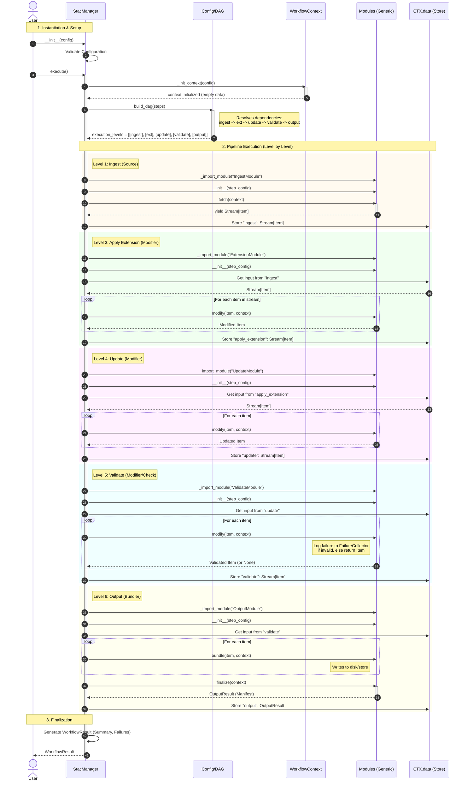

# StacManager System Visualization

This diagram illustrates how the `StacManager` orchestrator is instantiated, builds the pipeline, and executes the data flow through the requested steps: `ingest -> apply extension -> update -> validate -> output`.

