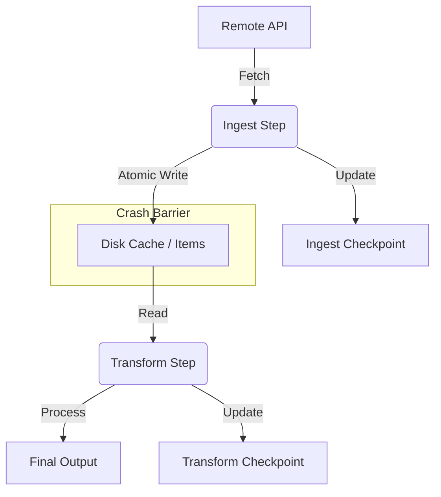

# Research: Fault Tolerance & State Persistence

**Status**: Analysis Complete  
**Related Components**: `WorkflowOrchestrator`, `CheckpointManager`, `OutputModule`

---

## 1. The Core Problem: Producer-Consumer Mismatch

The `08-state-persistence.md` spec solves **Intra-Step Idempotency** (ignoring items a step has already processed) but fails to address **Inter-Step Consistency** in a streaming/pipelined architecture.

### 1.1 The Crash Scenario (The "Gap")
Consider a pipeline: `IngestStep` -> `TransformStep`.
1.  `IngestStep` fetches Item A, queues it for `TransformStep`.
2.  `IngestStep` marks Item A as "Processed" in its checkpoint and saves to disk.
3.  `TransformStep` receives Item A in memory but crashes *before* processing it or saving its own checkpoint.
4.  **System Restart**:
    *   `IngestStep` loads checkpoint, sees Item A is done. **Skips Item A**.
    *   `TransformStep` loads checkpoint, sees Item A is NOT done. **Waits for Item A**.
5.  **Result**: Item A is lost. `TransformStep` never receives it because `IngestStep` believes it's already handled.

## 2. Solution Strategies

To fix the "Gap", we must decouple "fetching status" from "data availability" or implement strict acknowledgement protocols.

### 2.1 Strategy A: Strict Acknowledgement (Complex)
*   **Concept**: `IngestStep` only checkpoints Item A when `TransformStep` explicitly confirms it has persisted the result.
*   **Pros**: Minimal disk usage.
*   **Cons**: High coupling. Complex coordination in multi-consumer or distributed setups. "Head-of-line" blocking if downstream is slow.

### 2.2 Strategy B: Intermediate Persistence (Recommended)
*   **Concept**: Every step doesn't just pass generic objects in memory; it (optionally) spills outputs to a local "Disk Queue" (or Cache) which serves as the input for the next step.
*   **Flow**:
    1.  `IngestStep` writes Item A to `./cache/ingest_output/item_A.json`.
    2.  `IngestStep` checkpoints "Done".
    3.  `TransformStep` reads from `./cache/ingest_output/`.
*   **Recovery**: On restart, `IngestStep` skips fetching (checkpoint says done), but the file `item_A.json` still exists on disk for `TransformStep` to read.
*   **Pros**: perfectly decouples steps. Infinite retries for downstream bugs without re-fetching from API.
*   **Cons**: Higher disk I/O and storage usage.

### 2.3 Strategy C: Smart Replay (Low Storage)
*   **Concept**: `IngestStep` loads its checkpoint, but also checks `TransformStep`'s checkpoint.
*   **Logic**: `if (in_my_checkpoint AND NOT in_downstream_checkpoint): re_emit()`.
*   **Pros**: No intermediate storage.
*   **Cons**: Requires `IngestStep` to know about downstream topology. Breaks encapsulation. If `Ingest` is expensive (API cost), re-running is bad.

## 3. Recommended Architecture: Hybrid Persistence

We should adopt a **Hybrid Model** where "Heavy" steps use Intermediate Persistence, and "Light" steps use simple memory passing (accepting re-run cost).

### 3.1 The "Staged Checkpoint" Protocol

To avoid the "Gap" without full intermediate storage for everything, we define the **Unit of Work** carefully.

**If we stick to memory pipelines (No intermediate files):**
The `CheckpointManager` for the *Producer* must be effectively "Lagged" or tied to the *Consumer*.
*   Actually, a simpler rule works for the STAC Manager context: **Source of Truth is the Input**.
*   If `Ingest` is an API fetcher, it acts as a "Source".
*   If we restart, `Ingest` MUST iterate the candidate list again.
*   It checks `IngestCheckpoint`. If present, it normally skips.
*   **Fix**: For correct replay, `Ingest` should NOT be the one filtering based on `IngestCheckpoint` if that implies suppressing output.
    *   Actually, `Ingest` checkpointing implies "I have successfully *handed off* this item".
    *   If hand-off is memory-queue, "success" is fragile.

**Revised Application for STAC Manager V1:**
Given V1 targets local execution and simplicity, we should prioritize **Correctness** over **Speed/Storage**.

**Decision**: The "Outputs" of the `Ingest` phase should be persisted to a **Local Cache** (Intermediate Persistence).
*   `Ingest` -> Writes STAC Items to `/.stac-manager/cache/collection_id/items/...`
*   `Transform` -> iter_dir(cache) -> Process -> Output
*   This makes the workflow effectively a set of discrete phases rather than a live streaming pipe.
*   **Benefit**: This aligns with "Checkpointing" perfectly. If `Ingest` dies, resume fills the rest of the cache. If `Transform` dies, it resumes reading from the cache.

## 4. Technical Specifications for Implementation

### 4.1 CheckpointManager Hardening
The `CheckpointManager` needs to handle corruption.

```python
def load(self):
    try:
        df = read_parquet(...)
    except (OSError, ArrowInvalid):
        logger.error("Corrupt checkpoint file found. Moving to .corrupt and ignoring.")
        # Backup and start fresh (or safer: fail and ask user)
        self.quarantine_corrupt_files()
```

### 4.2 Graceful Shutdown Handling (SIGINT)
We cannot rely on atomic writes alone if the process terminates mid-logic.
*   Implement `signal.signal(signal.SIGINT, handler)`
*   `Handler` sets a global `STOP_REQUESTED` flag.
*   Workers check `STOP_REQUESTED` after each item.
*   If set, they finish the current item, flush the checkpoint, and exit cleanly.
*   **Hard Kill**: If user sends SIGINT twice (Force Kill), we rely on the `write-rename` atomicity of the Parquet files to ensure no partial files exist.

### 4.3 Zombie File Cleanup
*   On startup, `CheckpointManager` should scan for `*.tmp` or `.temp` files in its directory (leftovers from a crash during write).
*   Action: Delete them. They are by definition incomplete commits.

## 5. Summary of Requirements for V1.0

1.  **Mandatory Intermediate Cache**: Between `Discovery/Ingest` and `Transform` phases, items MUST be serialized to disk. This is the only robust way to handle crashes without complex acknowledgement protocols.
2.  **Atomic File Ops**: Enforce `write_to_temp` -> `flush` -> `os.replace` for all state files.
3.  **Corrupt State Recovery**: Startup routine must tolerate and quarantine unreadable state files.
4.  **Signal Handling**: Engine must catch `SIGINT` to flush pending batches before exit.

## 6. Diagram: The Robust Flow



By placing the **Disk Cache** (C) between steps, we ensure that even if E crashes and G is not updated, C remains available for E to try again on restart. D ensures B doesn't re-fetch A.
